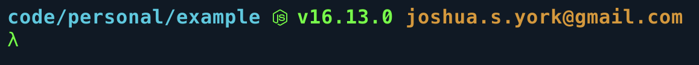

# Dotfiles

Managed by [rcm](https://github.com/thoughtbot/rcm)

Starship shell prompt preview:



## Steps for setting up a new machine

### Font

- Show hidden files (cmd+shift+. when in Finder)
- Download and install Fira Code Nerd Font

  https://www.nerdfonts.com/font-downloads

### SSH Key

- Generate ssh key and add to github

  https://docs.github.com/en/authentication/connecting-to-github-with-ssh/generating-a-new-ssh-key-and-adding-it-to-the-ssh-agent

  - `ssh-keygen -t ed25519 -C "joshua.s.york@gmail.com"`
  - `eval "$(ssh-agent -s)"`
  - `open ~/.ssh/config`
  - `touch ~/.ssh/config`
  - `vim ~/.ssh/config`
    ```
    Host *
    AddKeysToAgent yes
    UseKeychain yes
    IdentityFile ~/.ssh/id_ed25519
    ```
  - `ssh-add --apple-use-keychain ~/.ssh/id_ed25519`

### Setup dotfiles

- clone this repo, double check `DOTFILES_DIRS` env var value in `rcrc`
- `./macos-setup.sh`
- `rcup -d $HOME/code/personal/dotfiles`
- Allow press and hold for VSCode

  `defaults write com.microsoft.VSCode ApplePressAndHoldEnabled -bool false`

### MacOS System Settings

- Disable spotlight cmd+space
- Set Raycast trigger to cmd+space
- Import raycast settings from dropbox
- Change trackpad direction

  `Settings > Trackpad > Uncheck 'Scroll Direction: Natural'`

- Map Caps lock -> Escape

  `Settings > Keyboard > Modifier Keys`

- Disable automatic sorting of spaces

  `Settings > Mission Control > Uncheck 'Automatically rearrange Spaces'`

- Auto hide Dock

  `Settings > Desktop & Dock > check 'Automatically hide and show the Dock'`

- Set default browser

  `Settings > General`
